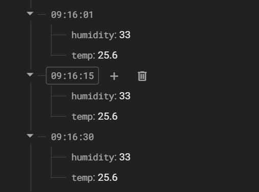

# ESP32 Firebase Temperature Logger

This is a full-stack IoT project using an **ESP32**, **DHT11 sensor**, and **0.96" OLED** that:
- ✅ Reads live temperature & humidity
- ✅ Displays values on OLED every 5 seconds
- ✅ Uploads data to Firebase Realtime Database every 10 seconds
- ✅ Uses REST API + ArduinoJSON for authentication and upload

---

## 🔧 Components
- ESP32 Dev Board
- DHT11 Sensor
- SSD1306 OLED (I2C, 0.96")
- Breadboard + Jumper Wires

---

## 💻 Code Features
- Firebase Auth with email/password
- Timestamped logging (HH:MM:SS format)
- OLED shows temp in large font + upload status
- Fully crash-safe with `isnan()` and error checking

---

## 📸 Screenshots

### OLED Output  


### Firebase Console  


---

## 🛠 Wiring (ESP32)

| Sensor/OLED  | ESP32 Pin |
|--------------|-----------|
| DHT11 Signal | D23       |
| OLED SDA     | D21       |
| OLED SCL     | D22       |
| GND          | GND       |
| VCC (both)   | 3.3V      |

---
## 🚀 How to Run This Project

1. **Install Arduino Libraries**  
   - `Adafruit_SSD1306`  
   - `Adafruit_GFX`  
   - `DHT sensor library`  
   - `ArduinoJson`

2. **Configure Firebase**  
   - Go to [Firebase Console](https://console.firebase.google.com)  
   - Create project → Realtime Database → Set to **test mode**  
   - Enable **Email/Password Authentication**  
   - Create a test user and use those credentials in the code

3. **Edit the Code**  
   Replace these with your actual values:
   ```cpp
   #define WIFI_SSID "YourWiFi"
   #define WIFI_PASSWORD "YourPassword"
   #define API_KEY "YourFirebaseAPIKey"
   #define DATABASE_URL "https://your-project.firebaseio.com"
---
Made by **Mohammad Wael** — First-year Computer Engineering @ APU  
#ESP32 #Firebase #IoT #Arduino #EmbeddedSystems
